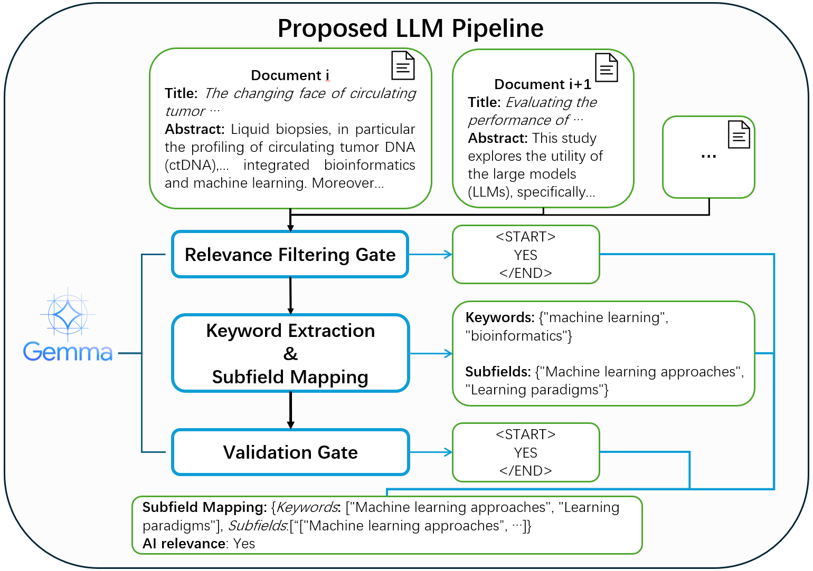

## Project Summary
BioMedJImpact-LLM operationalizes the pipeline described in *BioMedJImpact: A Comprehensive Dataset and LLM Pipeline for AI Engagement and Scientific Impact Analysis of Biomedical Journals*. The repository extracts AI engagement signals from 1.74M PMC articles, fuses them with bibliometric/collaboration indicators for 2,744 journals, and reproduces the three-stage LLM workflow validated in the paper. It supports (a) archive-scale extraction of journal-year statistics and (b) balanced sampling for human evaluation.

## Task Description
- Stream PMC OA tarballs, filter journal/year subsets, and tag AI-related abstracts with a three-stage Gemma-3 prompt cascade.
- Write streaming JSONL stats that capture tag/category counts plus article-level metadata for each `(ISSN_EISSN, year)`.
- Produce balanced AI vs non-AI samples (CSV/XLSX/JSONL) for human validation of the LLM pipeline.
- Provide Slurm + local launch instructions so collaborators can reproduce figures and tables from the manuscript.

## Repository Layout
```
BioMedJImpact-LLM/
├── configs/           # YAML configs for extract/sample jobs
├── data_schema/       # JSON schemas for emitted JSONL files
├── scripts/           # Slurm wrappers for both pipelines
├── src/bmj_pipeline/  # Installable Python package
├── environment.yml    # Conda environment
├── pyproject.toml     # Project metadata for pip install
└── README.md
```
Key modules under `src/bmj_pipeline/`:
- `prompts.py`: SYSTEM_PROMPT1/2/3 used in the paper.
- `parsing.py`: PMC XML parsing, ISSN/year filter, metadata normalization.
- `stats.py`: Streaming journal-year accumulator + consolidation helper.
- `extract_archive.py`: CLI entry point for full-archive processing.
- `sample_balanced.py`: CLI for balanced sampling outputs.

## Quick Start (Usage)
1. **Environment & install**
   ```bash
   conda env create -f environment.yml
   conda activate bmj-pipeline
   pip install -e .
   ```
2. **Configure paths**  
   Copy `configs/extract.yaml` or `configs/sample.yaml` and update archive paths, journal CSV locations, processed checkpoints, and model store references.
3. **Run extraction**
   ```bash
   python -m bmj_pipeline.extract_archive --config configs/extract.yaml
   ```
4. **Run balanced sampling**
   ```bash
   python -m bmj_pipeline.sample_balanced --config configs/sample.yaml
   ```
5. **Outputs**
   - `journal_tag_stats_XX.jsonl` + `processed_XX.txt` (schema in `data_schema/jsonl_stats.md`).
   - `sample_XX_XX_table.csv`, `sample_XX_XX_labels.xlsx`, `sample_XX_XX_logs.jsonl` (schema in `data_schema/sample_logs.md`).
6. **Cluster launch**  
   To run on cluster, submit `scripts/slurm_extract_archive.sh` or `scripts/slurm_sample_balanced.sh` after editing config paths; for local runs see `examples/run_local_extract.md` and `examples/run_local_sample.md`.

## Method Overview
<p align="center">
  
</p>

- **Three-stage LLM prompts**: Stage 1 filters AI relevance, Stage 2 extracts keywords + LIST-A categories, Stage 3 validates keywords—exactly mirroring the pipeline evaluated via human annotation in the manuscript.
- **Streaming PMC ingestion**: `parsing.iter_valid_articles` enforces ISSN/year filters, removes retractions, and normalizes metadata before invoking the LLM stages.
- **Journal-year stats**: `StatsStore` mirrors the paper’s JSON schema, enabling incremental saves/checkpoints and later consolidation across OA sections.
- **Balanced sampling**: Reuses the same LLM decisions to curate AI vs non-AI sets for human evaluation, reproducing the validation workflow described in Section 5 of the paper.
- **Post-processing**: Use `bmj_pipeline.stats.consolidate_stats` (and the legacy `calculate_ai_percentage` helper in the original repo) to merge section-level stats and compute AI engagement rates for downstream modeling/visualization.

License: MIT (see `LICENSE`).
